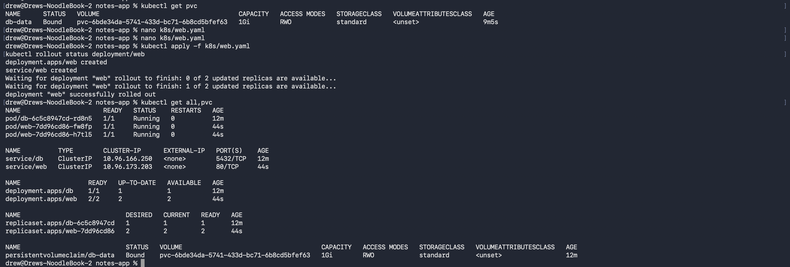
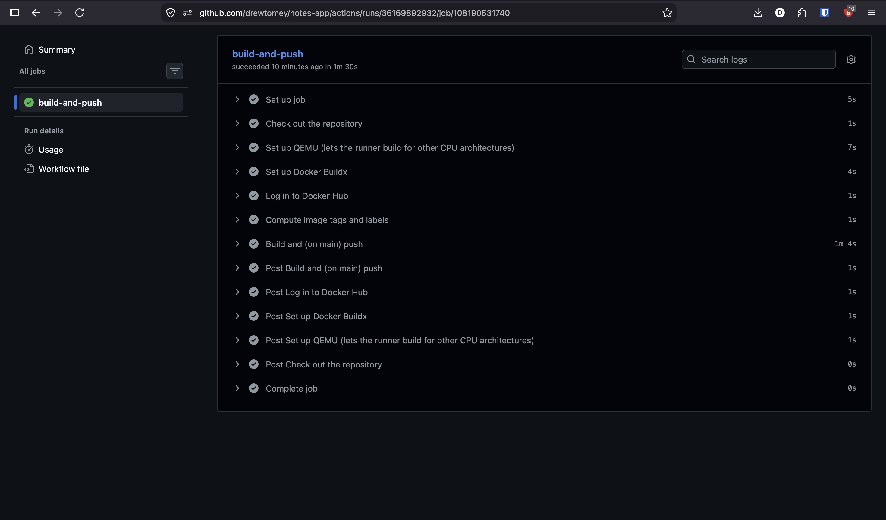
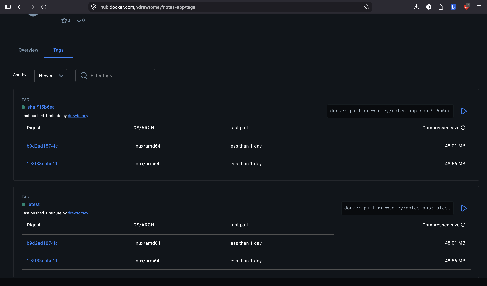

# EXPERIMENT 2
drew@Drews-NoodleBook-2 notes-app % curl http://localhost:8000/notes            
[{"body":"hello from kubernetes","created_at":"2026-09-25T18:34:36.161846+00:00","id":1},{"body":"I should survive a pod deletion","created_at":"2026-09-25T18:36:13.605591+00:00","id":2}]

# EXPERIMENT 3
drew@Drews-NoodleBook-2 notes-app % kubectl run curl --rm -it --restart=Never --image=curlimages/curl -- \
> sh -c 'for i in 1 2 3 4 5 6 7 8; do curl -s http://web/; echo; done'
{"message":"Hello from the notes app!","served_by":"web-7dd96cd86-58trs","service":"notes-app"}

{"message":"Hello from the notes app!","served_by":"web-7dd96cd86-2l2p2","service":"notes-app"}

{"message":"Hello from the notes app!","served_by":"web-7dd96cd86-vtf5k","service":"notes-app"}

All commands and output from this session will be recorded in container logs, including credentials and sensitive information passed through the command prompt.
If you don't see a command prompt, try pressing enter.
Session ended, resume using 'kubectl attach curl -c curl -n notes-lab -i -t' command
pod "curl" deleted from notes-lab namespace

# Output of kubectl get all,pvc

# GitHub Actions Screenshot

# Docker Hub Screenshot

# Output for Rollout History Deployment
drew@Drews-NoodleBook-2 notes-app % kubectl rollout history deployment/web
deployment.apps/web 
REVISION  CHANGE-CAUSE
1         <none>
2         <none>

drew@Drews-NoodleBook-2 notes-app % kubectl rollout history deployment/web
deployment.apps/web 
REVISION  CHANGE-CAUSE
1         <none>
2         <none>
